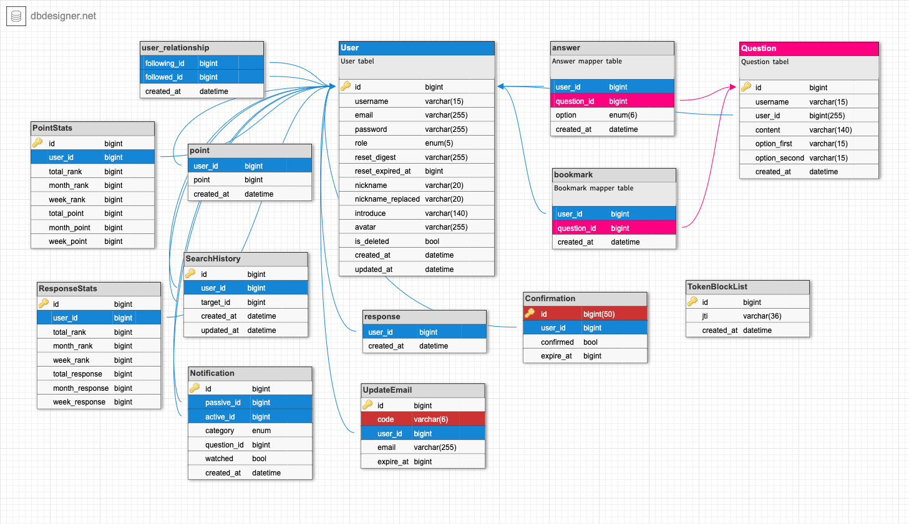
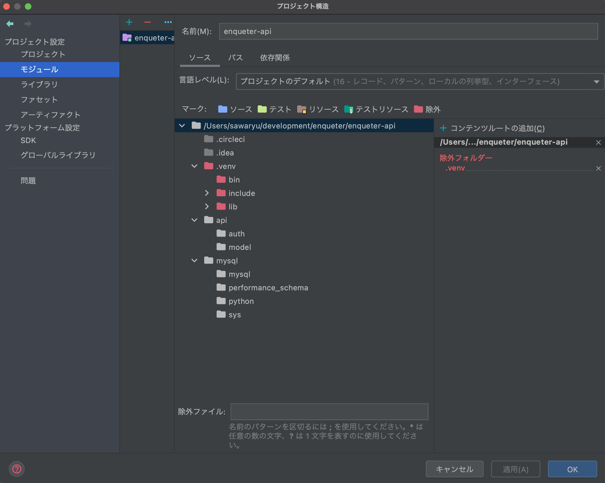

# Enqueter API

## Overview
API for Enqueter project.

`Development environment`
* MacOS (Bigsur)
* InteliJ IDEA (python community edition)
* python3.9.6 (flask)

## Setup
<u>1. venv</u>
```bash
# Create
$ python3 -m venv [ENV_NAME]
# Start
$ . .venv/bin/activate
# Shutdown
$ deactivate
# Clear
$ rm -rf ENV_NAME/
# Reset
$ python3 -m venv -clear ENV_NAME
```

<u>2. pip</u>
```bash
# Install libraries
$ pip install --upgrade pip
$ pip install -r requirements.txt
# Get list of installed libraries
$ pip list
$ pip freeze
# Output to requirements.txt
$ pip freeze > requirements.txt
```

## DB structure



## Attention
*　Doesn't work complement

Solved by assigning `.venv` as "exclude folder".



## Logging

How to log to uWSGI

> https://stackoverflow.com/questions/46846856/python-logging-flask-uwsgi-nginx

```python
#-- app.py
import logging
from flask.logging import default_handler

formatter = logging.Formatter(  # pylint: disable=invalid-name
    '%(asctime)s %(levelname)s %(process)d ---- %(threadName)s  '
    '%(module)s : %(funcName)s {%(pathname)s:%(lineno)d} %(message)s','%Y-%m-%dT%H:%M:%SZ')

handler = logging.StreamHandler()
handler.setFormatter(formatter)

app.logger.setLevel(logging.DEBUG)
app.logger.addHandler(handler)
app.logger.removeHandler(default_handler)

app.logger.debug('Debug Message')
app.logger.info('Info Message')
app.logger.warning('Warning Message')
app.logger.error('Error Message')
app.logger.critical('Critical ')
```

## Production error happned

```log
sqlalchemy.exc.IntegrityError: (pymysql.err.IntegrityError) (1451, 'Cannot delete or update a parent row: a foreign key constraint fails (`exampledb`.`rate`, CONSTRAINT `rate_ibfk_1` FOREIGN KEY (`user_id`) REFERENCES `user` (`id`))')
```